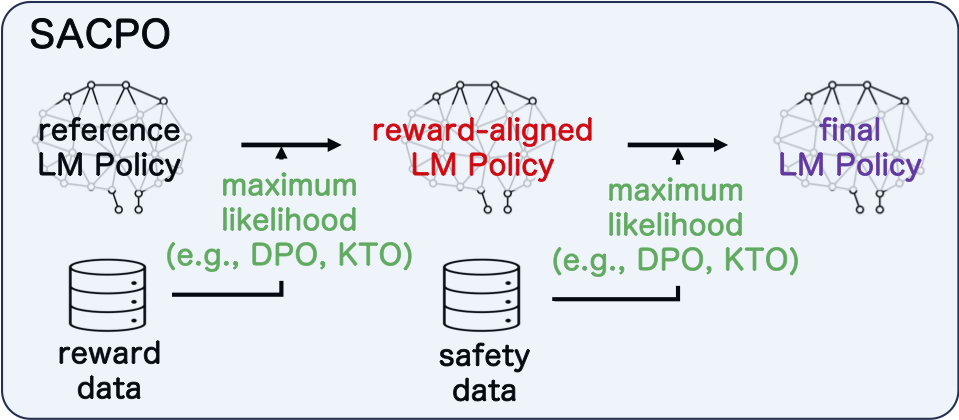
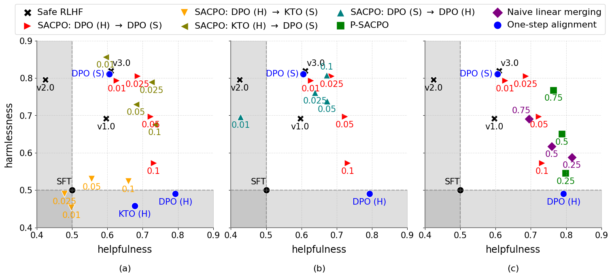

# SACPO: Stepwise Alignment for Constrained Policy Optimization
[](https://nips.cc/virtual/2024/poster/94870)
[](https://arxiv.org/abs/2404.11049)

<p align="center">
    
</p>

This repository provides the necessary code to replicate the experiments detailed in our NeurIPS-24 paper, [Stepwise Alignment for Constrained Language Model Policy Optimization](https://arxiv.org/abs/2404.11049). In these experiments, we utilized [TRL](https://github.com/huggingface/trl/tree/main) for implementing the alignment methods `DPO` and `KTO`, and [mergekit](https://github.com/arcee-ai/mergekit/tree/main) for `model merging`. The evaluation question lists `asset/helpful_problem.json` and `asset/safety_problem.json` were sourced from the [alpaca_eval dataset](https://huggingface.co/datasets/tatsu-lab/alpaca_eval/raw/main/alpaca_eval.json) and [safe-rlhf](https://github.com/PKU-Alignment/safe-rlhf/blob/main/safe_rlhf/evaluate/gpt4/problem.json), respectively.

## Pretrained Models
🤗 [SACPO](https://huggingface.co/line-corporation/sacpo) | 🤗 [P-SACPO](https://huggingface.co/line-corporation/p-sacpo)

## Getting Started
### Setting Up
First, set up a virtual environment and install the required packages. We recommend using Python 3.9 or newer.

```bash
python3 -m venv env
source env/bin/activate
pip install -r requirements.txt
```

### Environment Variables
You'll need to set up environment variables for mlflow (optional, to track experiment), Amazon S3 (optional, to log artifacts), and OpenAI (required, for evaluations). Fill in your authentication details in `script/set_envar.sh` and then run:

```bash
sh script/set_envar.sh
```

### Preparing Datasets
Next, prepare the training datasets for DPO and KTO from [PKU-Alignment/PKU-SafeRLHF-30K](https://huggingface.co/datasets/PKU-Alignment/PKU-SafeRLHF-30K).

```bash
python -m src.util prepare_all_datasets
```

## Experiments
### Experiment 1: DPO for Helpfulness -> DPO or KTO for Safety
1. **Align for Helpfulness (DPO):**

```bash
sh script/train/pku_helpful\(dpo\)_safety_train.sh helpful_dpo
```

2. **Align for Safety (DPO or KTO):**

```bash
sh script/train/pku_helpful\(dpo\)_safety_train.sh safety_dpo
sh script/train/pku_helpful\(dpo\)_safety_train.sh safety_kto
```

Successful training saves models in `output/30K_helpful_dpo_safety`.

3. **Generate Responses for Evaluation:**

```bash
sh script/evaluate/pku_helpful\(dpo\)_safety_eval.sh generate
```

4. **Evaluate with GPT-4:**

```bash
sh script/evaluate/pku_helpful\(dpo\)_safety_eval.sh evaluate_base
```

Generation and evaluation results will be saved in `output/eval`.

### Experiment 2: KTO for Helpfulness -> DPO for Safety
Follow similar steps as Experiment 1, replacing `helpful\(dpo\)` with `helpful\(kto\)` in the commands. 

Successful training saves models in `output/pku_helpful_kto_safety`.

Generation and evaluation results will be saved in `output/eval`.

### Experiment 3: DPO for Safety -> DPO for Helpfulness
This experiment reverses the order of alignment:

1. **Align for Safety (DPO):**

```bash
sh script/train/pku_safety\(dpo\)_helpful_train.sh safety_dpo
```

2. **Align for Helpfulness (DPO):**

```bash
sh script/train/pku_safety\(dpo\)_helpful_train.sh helpful_dpo
```

Successful training saves models in `output/pku_safety_dpo_helpful`.

1. **Generate Responses for Evaluation:**

```bash
sh script/evaluate/pku_safety\(dpo\)_helpful_eval.sh generate
```

3. **Evaluate with GPT-4:**

```bash
sh script/evaluate/pku_safety\(dpo\)_helpful_eval.sh evaluate_base
```

Generation and evaluation results will be saved in `output/eval`.

### Experiment 4: Practical Implementation (P-SACPO) Using Model Merging
1. **Create Merged Models:**

```bash
sh script/merge/pku_helpful\(dpo\)_safety_merge_create.sh
```

2. **Generate Responses for Evaluation:**

```bash
sh script/evaluate/pku_helpful\(dpo\)_safety_merge_eval.sh generate
```

Successful training saves models in `pku_helpful_dpo_safety_merge`.

3. **Evaluate with GPT-4:**

```bash
sh script/evaluate/pku_helpful\(dpo\)_safety_merge_eval.sh evaluate_base
```

Generation and evaluation results will be saved in `output/eval`.

## Compute score and plot results
To compute the win rates (from the above GPT-4 evaluation) and plot the main figure in our paper:

```bash
sh script/evaluate/plot_win_rates.sh
```

The summary of win rates and the corresponding plot will be located in `output/eval`. Finally, you can obtain a plot similar to the one below
<p align="center">
    
</p>

**Note:** 
- To evaluate the elo scores, please replace `evaluate_base` with `evaluate_full` in the GPT-4 evaluation step. Note that this change will cause the evaluation to compare every pair of models in each experiment, which may significantly increase the cost of using the GPT-4 API. After the evaluation is complete, you can run the following command to obtain the scores and plots:
```bash
sh script/evaluate/plot_elo_scores.sh
```
- Our scripts assume the experiments will be conducted on a machine equipped with 8 NVIDIA A100-80G GPUs. If your setup differs, you may need to adjust the accelerate configurations in `config/train`, and then modify `per_device_train_batch_size` or `gradient_accumulation_steps`.
- Please ensure all script paths and filenames are correct as per your directory structure. If you encounter any issues with the commands, verify the script names and paths are accurate. 

## Citation

If SACPO or this repository is useful in your research, please use the following BibTeX entry:

```
@inproceedings{
    wachi2024stepwise,
    title={Stepwise Alignment for Constrained Language Model Policy Optimization},
    author={Wachi, Akifumi and Tran, Thien Q. and Sato, Rei and Tanabe, Takumi and Akimoto, Youhei},
    booktitle={The Thirty-eighth Annual Conference on Neural Information Processing Systems},
    year={2024},
}
```

## License
[Apache License 2.0](LICENSE)

Additionally, this repository contains third-party software. Refer to [NOTICE.md](NOTICE.md) for more details and follow the terms and conditions of their use.
